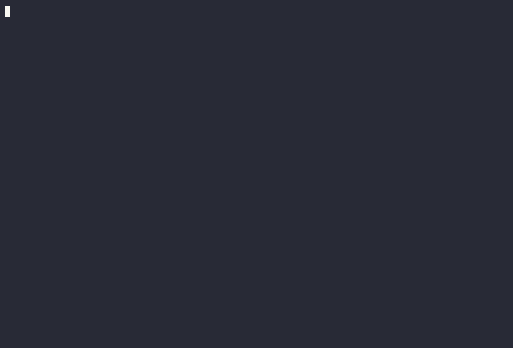

<!-- Terminal Gif -->

    
<b>Show Terminal</b> 🖥️

    

 

<!-- Welcome banner -->

    

<!-- Bonfire Gif -->

<!-- List -->
<ul>
     
    <li>
    🛠️ Currently working on restructuring this GitHub environment 
    </li> 
    <li>
    💻 Right now, I'm learning Go and CI/CD pipelines
    </li> 
    <li>
    ☁️ My next step is to start learning Cloud and working toward certifications
    </li> 
    <li>
    🕹️ Exploring Game Development in my free time
    </li>
</ul>

 

 

<!-- Tech Arsenal Icons -->

    
    
    

   

<!-- Contacts -->

    
    
    
      

<!-- 

  
  

 -->